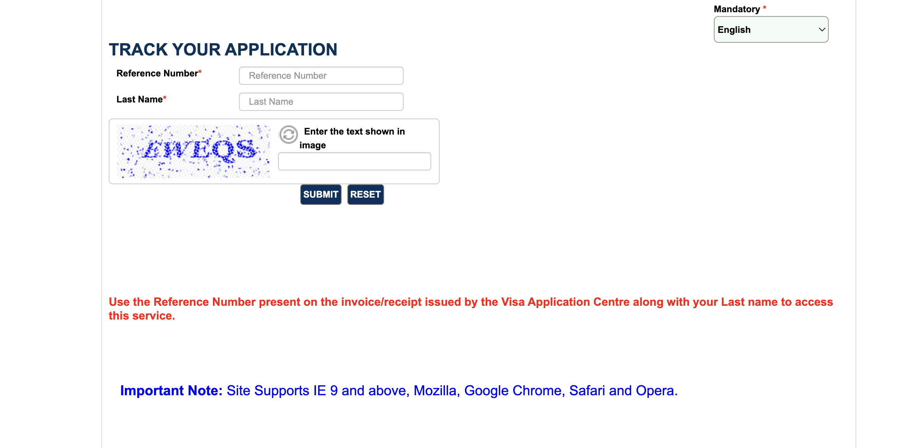

# VFS Netherlands Appointment & Application Tracking Bot

A script to check appointment slots and track your visa application status.

By default, it runs every hour to check for visa slots on the VFS website and notifies the user via Telegram. The interval can be adjusted in the config file.

## Table of Contents

- [How to Use](#how-to-use)
- [Dependencies](#dependencies)
- [Installing Geckodriver](#installing-geckodriver)
- [Contributor](#contributor)

## How to Use

1. **Clone the repository:**
    ```sh
    git clone https://github.com/kunalyelne/vfs_appointment_bot.git
    ```

2. **Navigate to the repository:**
    ```sh
    cd vfs_appointment_bot
    ```

3. **Update the config file (`config/config.ini`) with VFS, Twilio, and Telegram credentials:**
    - You can use either Telegram, Twilio, or both.
    - This can be specified with `use_telegram` and `use_twilio` config flags in the same file.

4. **Create a new virtual environment:**
    - Using `venv`:
      ```sh
      python3 -m venv venv
      ```
    - Using `conda`:
      ```sh
      conda create --name venv python=3.8
      ```

5. **Activate the environment:**
    - For `venv`:
      ```sh
      source venv/bin/activate
      ```
    - For `conda`:
      ```sh
      conda activate venv
      ```

6. **Install the dependencies:**
    ```sh
    pip install -r requirements.txt
    ```

7. **Run the script:**

### Appointment:
    ```sh
    python vfs_appointment_bot/vfs_appointment_bot.py '<vfs_centre>' '<visa_category>' '<visa_subcategory>'
    ```

    OR

    ```sh
    python vfs_appointment_bot/vfs_appointment_bot.py
    ```
    It will prompt the user for input values.

**Refer to the screenshot for more details regarding the inputs:**


### Application Tracking:
    ```sh
    python vfs_appointment_bot/vfs_application_tracking_bot.py '<reference_number>' '<last_name>'
    ```

    OR

    ```sh
    vfs_appointment_bot/vfs_application_tracking_bot.py
    ```
    It will prompt the user for input values.

**Refer to the screenshot for more details regarding the inputs:**



## Dependencies

1. Install Firefox Browser if not already installed.
2. `geckodriver` (Instructions to install `geckodriver` are provided below).
3. Setup clients for Twilio/Telegram or both:
    - **Twilio:**
      - Create an account on Twilio to get text and call alerts. Sign up [here](https://www.twilio.com/try-twilio).
    - **Telegram:**
      - Create a new bot via Telegram and add it to a chat group for notifications. Check out [this simple tutorial](https://medium.com/codex/using-python-to-send-telegram-messages-in-3-simple-steps-419a8b5e5e2) if you're unfamiliar with creating a new bot and getting its credentials. Add the bot's credentials to the `config/config.ini` file.
      - bot_token (Required): Your Telegram bot token obtained from BotFather.
      - chat_id (Required): The specific Telegram chat ID where you want to receive notifications. If omitted, the bot will send notifications to the chat where it was messaged from. To find your chat ID, you can create a group chat with just yourself and then use the /my_id command within the bot.
4. Obtain Google Vision API Key for resolving captcha.

## How to Set Up Google Vision API

To use the Google Vision API, you'll need to create a Google Cloud account, enable the Vision API, and generate an API key. Follow these steps:

### 1. Create a Google Cloud Account

If you don't have a Google Cloud account:

1. **Go to the Google Cloud Console**: [Google Cloud Console](https://console.cloud.google.com/).
2. **Sign in** with your Google account or create a new one.
3. **Agree to the terms of service** and set up your billing information. Google Cloud offers a free tier with credits that you can use for testing.

### 2. Create a New Project

1. **Navigate to the Dashboard**: In the Google Cloud Console, click on the project dropdown in the top navigation bar.
2. **Create a New Project**: Click "New Project".
3. **Enter Project Information**: Provide a project name and select your organization and billing account if prompted.
4. **Click "Create"**: Wait for the project to be created. You'll see a notification once it's ready.

### 3. Enable the Vision API

1. **Navigate to the API Library**: In the left-hand navigation menu, go to "APIs & Services" > "Library".
2. **Search for the Vision API**: In the search bar, type "Vision API".
3. **Enable the API**: Click on "Cloud Vision API" from the search results and then click the "Enable" button.

### 4. Create Credentials for the API

1. **Go to the Credentials Page**: In the left-hand navigation menu, go to "APIs & Services" > "Credentials".
2. **Create Credentials**: Click the "Create Credentials" button at the top and select "API key".
3. **Copy Your API Key**: Your new API key will be displayed. Copy it and store it securely, as you'll need it to authenticate your API requests.

## Installing Geckodriver

1. Download `geckodriver`:
    - Linux (example):
      ```sh
      wget https://github.com/mozilla/geckodriver/releases/download/v0.18.0/geckodriver-v0.18.0-linux64.tar.gz
      ```
      *(Find the latest release of `geckodriver` [here](https://github.com/mozilla/geckodriver/releases) for your machine.)*

2. Extract the file:
    ```sh
    tar -xvzf geckodriver*
    ```

3. Make it executable (if necessary):
    ```sh
    chmod +x geckodriver
    ```

4. Add the driver to your PATH in `~/.bashrc`:
    ```sh
    export PATH=$PATH:/path-to-extracted-file/geckodriver
    ```

## Contributor

- [Kunal Yelne](https://github.com/kunalyelne/)
